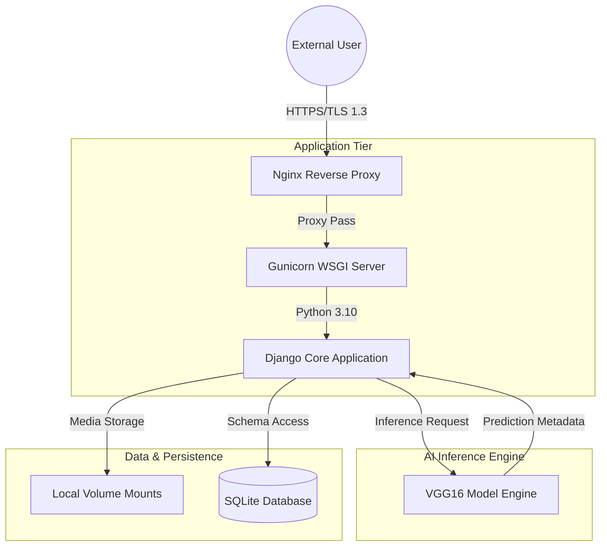

# System Architecture & Technical Design Document

**Project**: Burn Detection AI Platform  
**Version**: 1.0.0-PROD  
**Status**: Deployed  
**Classification**: Proprietary / Sensitive

## 1. System Overview
The Burn Detection AI Platform is an edge-optimized computer vision application designed to provide rapid classification of thermal injury severity. The system utilizes a distributed architecture consisting of a containerized application layer, a dedicated AI inference engine, and a hardened edge-proxy layer.

## 2. High-Level Architecture

## 3. Technology Stack & Frameworks
| Layer | Technology | Rationale |
| :--- | :--- | :--- |
| **Logic** | Django 5.x | Enterprise-grade security and robust ORM. |
| **AI/ML** | TensorFlow/Keras | Global standard for deep learning reliability. |
| **Server** | Gunicorn | High-concurrency WSGI handling. |
| **Edge Proxy** | Nginx | Superior request buffering and SSL termination. |
| **Container** | Docker | Environment parity and rapid deployment. |
| **Infrastructure** | AWS (EC2/EIP) | Global cloud presence and scalability. |

## 4. Operational Requirements
### 4.1 Resource Allocation
- **Compute**: AWS t2.micro / t3.small (Free Tier Optimized).
- **Environment**: Linux x86_64 (Ubuntu 22.04 LTS).
- **Memory Optimization**: 2.0GB Virtual Memory (Swap) enabled for AI model stability.
- **Inference Latency**: Target < 5.0s per image sub-processing.

### 4.2 Scaling Strategy
- **Horizontal**: Capability for AWS Auto-Scaling Group integration via pre-configured Docker images.
- **Vertical**: Seamless transition to GPU-accelerated instances (p3/g4dn families) for high-traffic scenarios.

## 5. Maintenance & Support
This documentation serves as the primary technical reference for the Burn Detection AI Platform. All future architectural changes must undergo a formal peer review and be documented via Version Control (Git).
